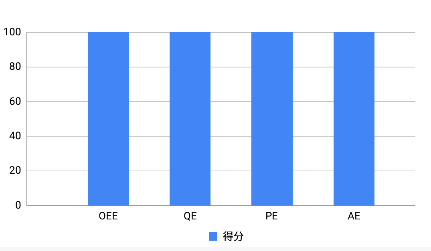
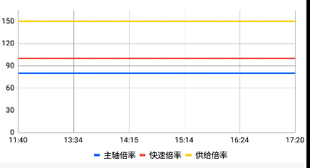
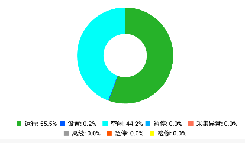
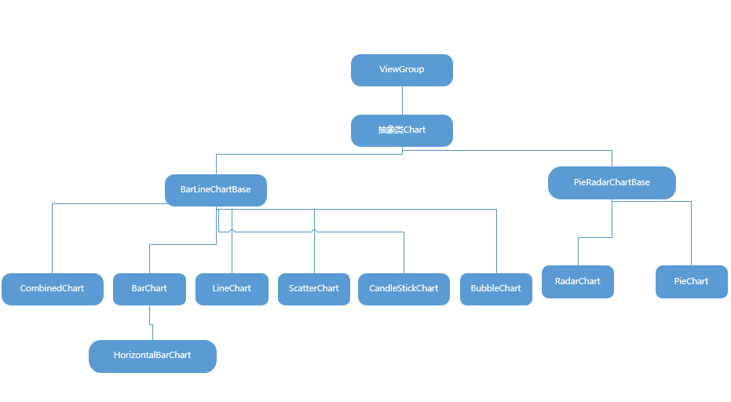

------


## 引言
　　最近一个项目要弄图表，以前就知道[MPAChart](https://github.com/PhilJay/MPAndroidChart),却没有上手过。这次仔细了解了一番，发现这货居然分为收费版和免费版。[○･｀Д´･ ○]，没办法只能研究免费版，也发现存在一些不便和问题。

## 集成
　　官方文档上直接抄过来：
　　第一步，project的build.gradle文件中加入如下代码：
```java
allprojects {
    repositories {
        maven { url "https://jitpack.io" }
    }
}
```
　　第二步，module的build.gradle文件中加入如下代码：
```
dependencies {
    implementation 'com.github.PhilJay:MPAndroidChart:v3.0.3'
}
```
　　相信大家都会的！！！
    
## 上手
　　讲真这个东西用起来不是很方便啊，控件没提供多少xml属性，布局如下：
```xml
 <com.github.mikephil.charting.charts.BarChart
        android:layout_marginTop="10dp"
        android:id="@+id/bc_oee"
        android:layout_width="match_parent"
        android:layout_height="match_parent">
    </com.github.mikephil.charting.charts.BarChart>
```
　　获取View然后进行一些初始化（样例取自项目中的代码，主要为了描述基本步骤）：
```java
    private void initOEEChart(){
        barEntries = new ArrayList<>();   //数据源
        mBCOEE.setFitBars(true);          //高度自适应
        mBCOEE.setTouchEnabled(false);    //不可触摸
        initDescription();                
        initXAxis();
        initYAxis();
        initLegend();
        mBCOEE.setNoDataText("暂无数据");  //没数据是提示
    }
```
　　初始化描述图表描述：
```java
    private void initDescription(){
        Description description = mBCOEE.getDescription();
        description.setText("");
    }
```
　　初始化X轴、Y轴：
```java
    private void initXAxis(){
        XAxis xAxis = mBCOEE.getXAxis();
        xAxis.setPosition(XAxis.XAxisPosition.BOTTOM);//设置x轴显示在底部，默认在顶部
        xAxis.setGranularity(1f);//设置步长
        xAxis.setAxisMinimum(0f);
        xAxis.setValueFormatter(new IAxisValueFormatter() {
            @Override
            public String getFormattedValue(float value, AxisBase axis) {
                if(value == 1f){
                    return "OEE";
                }
                if(value == 2f){
                    return "QE";
                }
                if(value == 3f){
                    return "PE";
                }
                if(value == 4f){
                    return "AE";
                }
                return "";
            }
        });
    }

    private void initYAxis(){
        YAxis leftAxis = mBCOEE.getAxisLeft();
        YAxis rightAxis = mBCOEE.getAxisRight();

        leftAxis.setAxisMinimum(0f);
        leftAxis.setAxisMaximum(100f);
        leftAxis.setGranularity(5f);

        rightAxis.setEnabled(false);  //默认是有两个Y轴，即左右两边，这里让右边不展示
    }


```
　　初始化图例：
```java
    private void initLegend(){
        Legend legend = mBCOEE.getLegend();
        legend.setVerticalAlignment(Legend.LegendVerticalAlignment.BOTTOM);   //显示在底部，显示在左侧的时候会有延迟显示的问题，要达到像支付宝资产那样的图例，有问题
        legend.setHorizontalAlignment(Legend.LegendHorizontalAlignment.CENTER);//水平居中
        legend.setOrientation(Legend.LegendOrientation.HORIZONTAL);
        legend.setDrawInside(false);
        LegendEntry legendEntry = new LegendEntry();
        legendEntry.label = "得分";
        legendEntry.formColor = ContextCompat.getColor(getActivity(),R.color.oee_color);
        legend.setCustom(new LegendEntry[]{legendEntry});//使用自定义的图例，默认会根据数据自动生成
    }
```
　　最后就是动态绑定数据,如果数据是静态的，在初始化的时候直接设置进去，也是可以的 ：
```java
    private void showOEE(OEE oee){
        barEntries.clear();
        if(oee != null){
            barEntries.add(new BarEntry(1,oee.getOee()));
            barEntries.add(new BarEntry(2,oee.getQe()));
            barEntries.add(new BarEntry(3,oee.getPe()));
            barEntries.add(new BarEntry(4,oee.getAe()));
        }
        barDataSet = new BarDataSet(barEntries,"");
        barDataSet.setColors(ContextCompat.getColor(getActivity(),R.color.oee_color));
        barData = new BarData(barDataSet);
        barData.setBarWidth(0.5f);
        mBCOEE.setData(barData);
        mBCOEE.invalidate();
    }
```
　　现在看看效果：

　　还有其它类型的图标，套路都是一样的，效果如下：
 
　　一番折腾之后，基本达到了想要的效果。现在既然会用了，后面要是再出Diy的效果，就得去动动源码了。这里咱先不动源码，先熟悉一下源码。

## 深入

　　先简单的看一下各种图表之间的关系，如下图

<li>图表是一个自定义ViewGroup，所有图表的基类都是Chart类,如果修改所有图表的共性，就修改Chart类;</li>

### 几个重要的类

<li>AxisBase 坐标轴的基类，子类有XAxis，YAxis,以及它重要的几个属性</li>
```java
    /**
     * 最小刻度单位
     */
    protected float mGranularity = 1.0f;
    /**
     * 值集合，就是轴对应的类型只能是浮点型
     */
    public float[] mEntries = new float[]{};
    /**
     * 轴上显示的x度数，默认是 6
     */
    private int mLabelCount = 6;

    /**
     * 值格式器，可以将float转换为想要的字符串
     */
    protected IAxisValueFormatter mAxisValueFormatter;
    //坐标轴颜色
    private int mAxisLineColor = Color.GRAY;
    //坐标轴线宽
    private float mAxisLineWidth = 1f;
```
<li>Legend 图例类，它的格式可以如下:</li>
```java
 public enum LegendForm {
        /**
         * Avoid drawing a form
         */
        NONE,

        /**
         * Do not draw the a form, but leave space for it
         */
        EMPTY,

        /**
         * Use default (default dataset's form to the legend's form)
         */
        DEFAULT,

        /**
         * Draw a square
         */
        SQUARE,

        /**
         * Draw a circle
         */
        CIRCLE,

        /**
         * Draw a horizontal line
         */
        LINE
    }
    //水平对齐方式
    public enum LegendHorizontalAlignment {
        LEFT, CENTER, RIGHT
    }
    //垂直对齐方式
    public enum LegendVerticalAlignment {
        TOP, CENTER, BOTTOM
    }
    //显示方向
    public enum LegendOrientation {
        HORIZONTAL, VERTICAL
    }
    //内容排列方向
    public enum LegendDirection {
        LEFT_TO_RIGHT, RIGHT_TO_LEFT
    }
```
<li>Description 图表描述类，这个比较简单，不说了</li>
<li>BaseEntry 数据源基类，即X轴、Y轴数据集合都是该类的子类的集合，它属性简介：</li>
```java

    /** 对应在坐标轴上的值 */
    private float y = 0f;

    /** 该点对应的数据结构 */
    private Object mData = null;

    /** 该点对应的图标 */
    private Drawable mIcon = null;
```
<li>ChartData 图表数据源持有类，所有的图表设置数据都是setData(T)，而T就是ChartData的子类</li>

## 浅出
简单了看了一圈，可以看到图表本身就是一个ViewGroup，而在绘制不同图表时，通过重写onDraw()方法来实现，我们可以通过操纵属性，来坐一些简单的Diy。

------
欢迎大家，一起来探讨技术!!!


