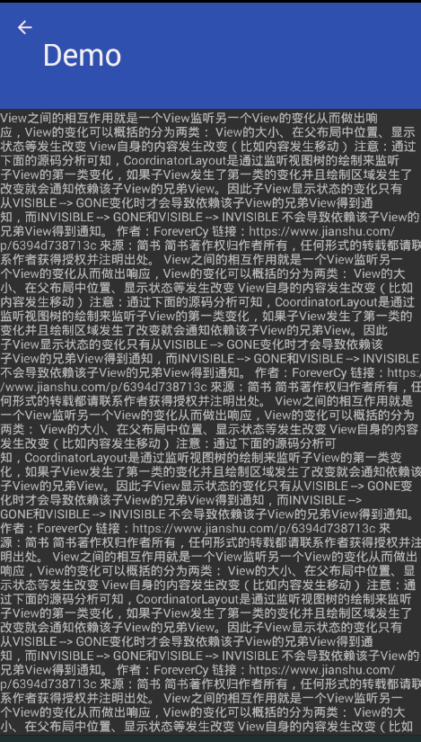
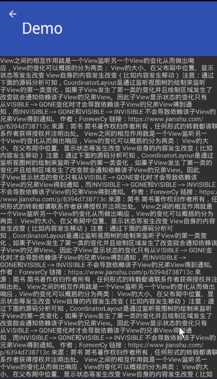
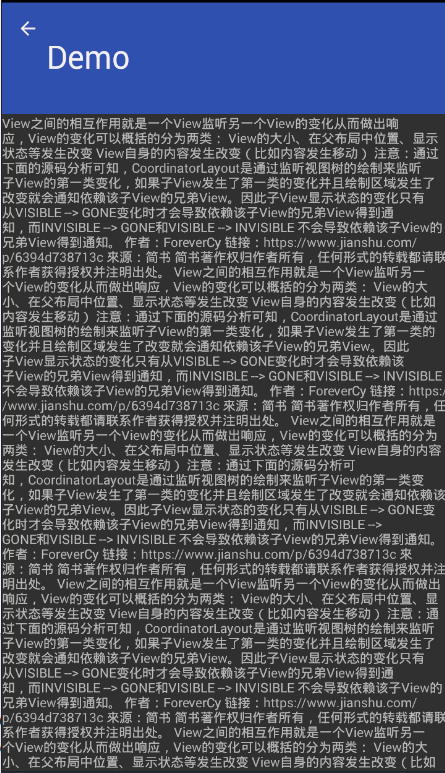

## 引言
　　作为一名社会编程人员，每天面对茫茫多的知识，常常感觉大脑内存不够，运行卡顿，所以需要记在“硬盘”上，时不时在需要时翻阅一下。
　　因此从本篇开始，开启一个《以为会系列》，记录自己日常开发中用的比较少的一类知识点，但也很重要的一些。这些都是自己实际工作中的一些实际感受总结来的，希望对看到的各位有所帮助。
　　进入正题，这篇讲述一下，平时用的较少，但很有用，很有逼格的一个布局——CoordinatorLayout。为啥说它的使用很有逼格呢，看看下面的效果图：

## PS:CoodinatorLayout是不支持ListView和ScrollView的，我在这个坑里滞留了好久！！！

## CoodinatorLayout 属性
　　CoordinatorLayout是一个特殊ViewGroup，它的类定义如下：
```
public class CoordinatorLayout extends ViewGroup implements NestedScrollingParent2
```
　　
　　在官网上我们也可以看到一句话“CoordinatorLayout is a super-powered FrameLayout”，说明我们可以像用FrameLayout一样使用它。但是它有一些特殊的属性，它的一些强大的功能就是依赖于此。如下，罗列了一些它提供的属性，从源码对应的R文件中查看它定义的属性,这样会比较全。这里会说明常用的属性：
```
    //用在它子View上的属性，用法如：“app:layout_behavior=""”（请学会举一反三）
    /*就是layout_gravity属性*/
    public static final int CoordinatorLayout_Layout_android_layout_gravity = 0;
    /*设置依赖的View*/
    public static final int CoordinatorLayout_Layout_layout_anchor = 2;
    /*设置相对于依赖View的位置*/
    public static final int CoordinatorLayout_Layout_layout_anchorGrav= 4;
    /*定义behavior*/
    public static final int CoordinatorLayout_Layout_layout_behavior = 1;
    /*找了一些资料，没看明白*/
    public static final int CoordinatorLayout_Layout_layout_dodgeInsetEdges = 6;
    public static final int CoordinatorLayout_Layout_layout_insetEdge = 5;
    public static final int CoordinatorLayout_Layout_layout_keyline = 3;

    //用在它自身的属性 用法如：“app:statusBarBackground=""”
    public static final int CoordinatorLayout_keylines = 0;
    /*状态栏背景，实现沉浸式Style*/
    public static final int CoordinatorLayout_statusBarBackground = 1;
```

## CoodinatorLayout 布局用法
　　首先，在用之前要添加依赖，CoordinatorLayout是design包里的控件，所以使用之前添加如下依赖：
```
compile 'com.android.support:design:26.0.0'
```
### 常规用法
　　直接上代码：
```
<?xml version="1.0" encoding="utf-8"?>
<android.support.design.widget.CoordinatorLayout
    xmlns:android="http://schemas.android.com/apk/res/android"
    xmlns:app="http://schemas.android.com/apk/res-auto"
    app:statusBarBackground="@android:color/white"
    android:layout_width="match_parent"
    android:layout_height="match_parent">
    <!--标准的头部-->
    <android.support.design.widget.AppBarLayout
        android:layout_width="match_parent"
        android:layout_height="wrap_content">
        <android.support.design.widget.CollapsingToolbarLayout
            android:layout_width="match_parent"
            android:layout_height="wrap_content">
            <android.support.v7.widget.Toolbar
                android:layout_width="match_parent"
                android:layout_height="?attr/actionBarSize">
                
            </android.support.v7.widget.Toolbar>
        </android.support.design.widget.CollapsingToolbarLayout>
    </android.support.design.widget.AppBarLayout>

    <!--这里可以替换为任何你想放置的View(能够响应滑动的View，如RecycleView等)-->
    <View
        android:layout_width="match_parent"
        android:layout_height="match_parent"/>

</android.support.design.widget.CoordinatorLayout>
```
#### AppBarLayout
　　它本身是一个纵向的LinearLayout，提供了许多样式属性，具体可以查看源码，不做过多说明。有一个提供给它的子View的属性，可以了解一下：
layout_scrollFlags，对应的值为：scroll，enterAlways，enterAlwaysCollapsed，snap，exitUntilCollapsed；
scroll:就是响应CoordinatorLayout里的滚动事件，不加此属性，会驻留，不滚动


enterAlways:使用此属性(scroll|enterAlways)，表示在下滑进入显示时，优先滑动头部

enterAlwaysCollapsed:使用此属性(scroll|enterAlways|enterAlwaysCollapsed),表示在下滑进入显示时，优先滑动折叠式头部，再滑动列表，最后展开头部

exitUntilCollapsed:使用此属性(scroll|exitUntilCollapsed),表示上滑时，折叠后的头部，一直存在。

snap:此属性可以搭配上面任意属性，表示不允许停留在中间状态


#### CollapsingToolbarLayout
　　它实质是一个FrameLayout，从名字上可以意会为可折叠的Toolbar布局，它的属性几个可以了解一波：
app:contentScrim:折叠之后toolbar的颜色

app:scrimAnimationDuration:视差效果渐变动画时间

app:layout_collapseMode：用于它的子View，折叠模式，取值可以是none/pin/parallax，这里直接给出一份常用配置，这么用就好了，因为我每个组合都试过。
app:title: 就是header里的大标题
app:toolbar: 指定toolbar，貌似没啥效果，默认要toolbar放第二个view才可以，其它属性看名字就能理解的。看下面的示例代码
``` 
<android.support.design.widget.CollapsingToolbarLayout
            app:contentScrim="@color/blue"
            app:expandedTitleGravity="left"
            app:collapsedTitleGravity="left"
            app:expandedTitleMargin="48dp"
            app:title="测试"
            app:scrimAnimationDuration="1000"
            app:toolbarId="@+id/toolbar"
            app:layout_scrollFlags="scroll|exitUntilCollapsed|snap"
            android:background="@color/colorPrimary"
            android:layout_width="match_parent"
            android:layout_height="120dp">
            <!--这个ImageView可以换成你自己想要的任何可折叠头部-->
            <ImageView
                app:layout_collapseMode="parallax"
                app:layout_collapseParallaxMultiplier="0"
                android:scaleType="fitXY"
                android:src="@mipmap/image"
                android:layout_width="match_parent"
                android:layout_height="match_parent" />
            <android.support.v7.widget.Toolbar
                app:contentInsetStart="0dp"
                app:layout_collapseMode="pin"
                app:theme="@style/OverFlowMenuTheme"
                android:id="@+id/toolbar"
                android:layout_width="match_parent"
                android:layout_height="56dp">

            </android.support.v7.widget.Toolbar>
    </p>
```


最后，贴一下完整代码：
```
<?xml version="1.0" encoding="utf-8"?>
<android.support.design.widget.CoordinatorLayout
    xmlns:android="http://schemas.android.com/apk/res/android"
    xmlns:app="http://schemas.android.com/apk/res-auto"
    android:layout_width="match_parent"
    android:layout_height="match_parent">
    <android.support.design.widget.AppBarLayout
        android:layout_width="match_parent"
        android:fitsSystemWindows="true"
        android:theme="@style/ThemeOverlay.AppCompat.Dark.ActionBar"
        android:layout_height="wrap_content">
        <android.support.design.widget.CollapsingToolbarLayout
            app:contentScrim="@color/blue"
            app:expandedTitleGravity="left"
            app:collapsedTitleGravity="left"
            app:expandedTitleMargin="48dp"
            app:title="测试"
            app:scrimAnimationDuration="1000"
            app:toolbarId="@+id/toolbar"
            app:layout_scrollFlags="scroll|exitUntilCollapsed|snap"
            android:background="@color/colorPrimary"
            android:layout_width="match_parent"
            android:layout_height="120dp">
            <ImageView
                app:layout_collapseMode="parallax"
                app:layout_collapseParallaxMultiplier="0"
                android:scaleType="fitXY"
                android:src="@mipmap/image"
                android:layout_width="match_parent"
                android:layout_height="match_parent" />
            <android.support.v7.widget.Toolbar
                app:contentInsetStart="0dp"
                app:layout_collapseMode="pin"
                app:contentInsetStartWithNavigation="5dp"
                app:navigationIcon="@mipmap/icon"
                app:theme="@style/OverFlowMenuTheme"
                android:id="@+id/toolbar"
                android:layout_width="match_parent"
                android:layout_height="56dp">

            </android.support.v7.widget.Toolbar>


        </android.support.design.widget.CollapsingToolbarLayout>
    </android.support.design.widget.AppBarLayout>
    <android.support.v4.widget.NestedScrollView
        android:id="@+id/lv"
        app:layout_behavior="@string/appbar_scrolling_view_behavior"
        android:layout_width="match_parent"
        android:layout_height="match_parent">
        <TextView
            android:text="@string/text"
            android:layout_width="match_parent"
            android:layout_height="match_parent" />

    </android.support.v4.widget.NestedScrollView>

</android.support.design.widget.CoordinatorLayout>
```
app:layout_behavior="@string/appbar_scrolling_view_behavior"  这一句就是普通用法的关键，本质是用了AppBarLayout提供的一个Behavior；
#### ToolBar
　　ToolBar我认为是没啥好说的，就是一个Toolbar，它的属性也是看名字就能理解的。
app:contentInsetStartWithNavigation="5dp"  标题距离返回箭头的距离
app:navigationIcon="@mipmap/icon"   指定返回按钮的资源

### 定制用法
　　上面提到了AppBarLayout提供的Behavior，如果我们要使用定制用法，就得自己自定义Behavior。基本如下，Behavior<T> 其中T就是我们需要指定的一个可以产生滑动的View，这里我就用RecyclerView
```
public class CustomBehavior extends CoordinatorLayout.Behavior<RecyclerView> {

    
}
```
　　然后就是根据自己的需求，复写需要的方法,这里简单的罗列了一些经常用的：
```
public class CustomBehavior extends CoordinatorLayout.Behavior<RecyclerView> {

    /**
     * 指定哪些View响应变化
     * @param parent
     * @param child
     * @param dependency
     * @return
     */
    @Override
    public boolean layoutDependsOn(CoordinatorLayout parent, RecyclerView child, View dependency) {
        return super.layoutDependsOn(parent, child, dependency);
    }

    /**
     * 当View变化时，执行哪些操作
     * @param parent
     * @param child
     * @param dependency
     * @return
     */
    @Override
    public boolean onDependentViewChanged(CoordinatorLayout parent, RecyclerView child, View dependency) {
        return super.onDependentViewChanged(parent, child, dependency);
    }

    /**
     * 来筛选响应哪种滑动，有垂直方向 和水平方向的滑动
     * @param coordinatorLayout
     * @param child
     * @param directTargetChild
     * @param target
     * @param axes
     * @param type
     * @return
     */
    @Override
    public boolean onStartNestedScroll(@NonNull CoordinatorLayout coordinatorLayout, @NonNull RecyclerView child, @NonNull View directTargetChild, @NonNull View target, int axes, int type) {
        return super.onStartNestedScroll(coordinatorLayout, child, directTargetChild, target, axes, type);
    }
}
```

时间关系，定制的方式暂时不去深究了，日后需要时，再深入研究！！
------
欢迎大家，一起来探讨技术!!!
