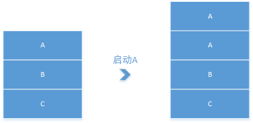
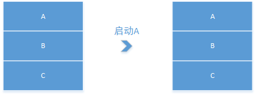
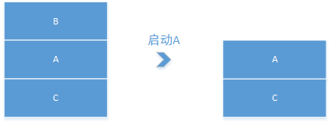

------


## 引言
　　Activity启动模式是一个老生常谈的话题，但平时并没有仔细去推敲，所以呢，就有了这篇文章呀，哈哈哈，找个理由写博客！

## 概念
　　所谓启动模式，是指我们为打开Activity而设置的一个标记。这个标记的值总共有四种：
<li>standard：是Activity默认的启动模式，每次启动Activity都会创建一个新的实例，无论任务栈中是否有Activity实例。</li>
<li>singleTop：当Activity处在栈顶时，创建新的Activity直接复用当前Activity，若Activity存在于任务栈中但是不在栈顶，则会重新创建一个新的Activity。</li>
<li>singleTask：当Activity在栈顶时，原理同singleTop，当Activity存在于任务栈但不在栈顶时，依旧会复用此Activity，同时销毁其上方的Activity，使它位于栈顶</li>
<li>singleInstance：全局唯一的单例模式，是加强版的singleTask，像应用桌面(Launcher)等系统应用使用。</li>


## 深入理解
设置Activity的启动模式只需要在注册Activity时加上launchMode字段，如下:
```xml
<activity
            android:name="com.tencent.tauth.AuthActivity"
            android:launchMode="singleTask"> //设置Activity的启动模式
</activity>
```


### standard
不管是否存在Activity的实例，每次都会创建一个新的，原理如下图：

默认我们在注册Activity时，默认就是standard;
### singleTop
场景一，当Activity在栈顶时，就会复用Activity，效果如下图：

场景二，当Activity不在栈顶时，就会重新创建，效果如下图：

### singleTask
场景一，当Activity在栈顶时，就会复用Activity，效果如下图：

场景二，当Activity不在栈顶时，依旧会复用Activity，效果如下图：

singleTask只在一个任务栈中保持唯一，如果不是同一个任务栈，依然会创建一个新的实例。
### singleInstance
基本效果，同singleTask一致，但是Activity如果是singleInstance模式时，在所有的任务栈中都保持唯一；

<span style="color: #FF0000">PS:以上所说的场景都没有说任务栈中没有Activity实例的情况，因为都一样，如果没有，就创建新的。</span>

## 补充理解
这里补充一点相关的其它知识：
### 什么是任务栈
任务栈Task，是一种用来放置Activity实例的容器，他是以栈的形式进行盛放，也就是所谓的先进后出，主要有2个基本操作：压栈和出栈，其所存放的Activity是不支持重新排序的，只能根据压栈和出栈操作更改Activity的顺序。

启动一个Application的时候，系统会为它默认创建一个对应的Task，用来放置根Activity。默认启动Activity会放在同一个Task中，新启动的Activity会被压入启动它的那个Activity的栈中，并且显示它。当用户按下回退键时，这个Activity就会被弹出栈，按下Home键回到桌面，再启动另一个应用，这时候之前那个Task就被移到后台，成为后台任务栈，而刚启动的那个Task就被调到前台，成为前台任务栈，Android系统显示的就是前台任务栈中的Top实例Activity。[参考](https://www.jianshu.com/p/2a9fcf3c11e4);

### Flag
除了上面所说的手法来设置Activity的启动模式外，我们还有一些其它的跟Activity启动模式相关的东西，就是FLAG。
我们启动Activity时，通常是创建一个Intent，同时我们可以设置Flag，如下：
```java
 Intent intent = new Intent(activity, PlayerDetailNewActivity.class);
 intent.addFlags(Intent.FLAG_ACTIVITY_NEW_TASK); //
```
#### FLAG_ACTIVITY_NEW_TASK
在一个新的任务栈中打开Activity，比如在广播、Service中打开Activity时，需要设置启动标致为FLAG_ACTIVITY_NEW_TASK。
#### FLAG_ACTIVITY_SINGLE_TOP
跟SingleTop功能一致

#### FLAG_ACTIVITY_NO_HISTORY
启动的这个Activity不会加入历史堆栈，比如A->B->C，其中启动B时设置标致为此标致位，那么从C返回后，会直接返回到A
#### FLAG_ACTIVITY_CLEAR_TOP
跟SingleTask功能一致

## 浅出
通过上述的一波分析，貌似对Activity的启动模式认识更加清晰了一些。


------
欢迎大家，一起来探讨技术!!!


