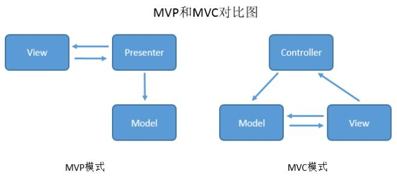
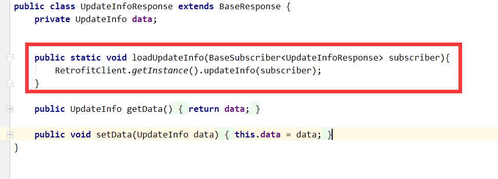

------

## 引言
　　这两天又把自己以前写的[APP快速框架](https://github.com/wintonBy/APPFram)整理了一番，发现以前写的有些理解不是很到位，尤其是对Model的理解，所以这一次又重新理一下。

### MVP
　　之前写MVP时，会首分一个http包，里面放网络相关东西，比如RetrofitClient、各种Response等等，然后在Presenter中进行数据获取，即网络接口的调用。
这种做法的好处是：
<li>比较直观，容易理解</li>
<li>直接处理各种网络异常、数据异常等</li>
弊端：
<li>网络加载都跟Presenter有关，代码复用性变低</li>
之后把自己原先理解的MVP做一次调整，把调用网络加载的的地方下方到Model中，可以使代码复用性更高。举例说明：
#### Model
```
public class UpdateInfoResponse extends BaseResponse {
    private UpdateInfo data;

    public static void loadUpdateInfo(BaseSubscriber<UpdateInfoResponse> subscriber){
        RetrofitClient.getInstance().updateInfo(subscriber);
    }

    public UpdateInfo getData() {
        return data;
    }

    public void setData(UpdateInfo data) {
        this.data = data;
    }
}
```
#### Presenter调用
```
    public void checkVersion() {
        UpdateInfoResponse.loadUpdateInfo(new BaseSubscriber<UpdateInfoResponse>(){
            @Override
            public void onNext(UpdateInfoResponse updateInfoResponse) {
                super.onNext(updateInfoResponse);
                if(!updateInfoResponse.isSuccess()){
                    LogUtils.eTag(TAG,updateInfoResponse.getMessage());
                    return;
                }
                if(hasNewVersion(updateInfoResponse.getData())){
                    getView().showNewVersion(updateInfoResponse.getData());
                }
            }

            @Override
            public void onError(Throwable e) {
                super.onError(e);
            }
        });
    }
```
考虑到这么做是因为个人觉得Presenter的变动会比Model变动更大。
考虑到一些共性时，可在model中再封装一次回调，使调用者做更少的事情。


------
欢迎大家，一起来探讨技术!!!

